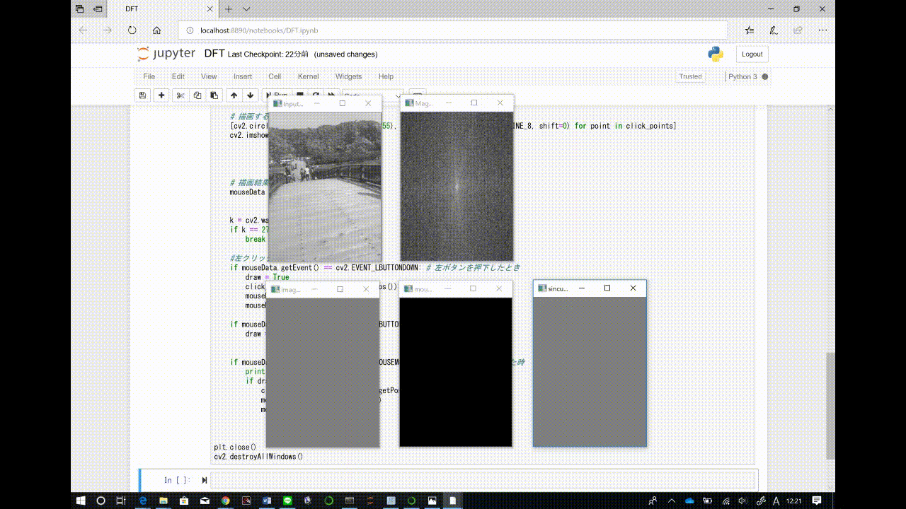

# フーリエ変換・逆変換
このプログラムはpython3.7.3環境で作成、実行を行った．

## 処理の内容
``` python
img = cv2.imread('image2.jpg',0)
f = np.fft.fft2(img)
fshift = np.fft.fftshift(f)
magnitude_spectrum = 20*np.log(np.abs(fshift))
cv2.normalize(magnitude_spectrum, magnitude_spectrum, 0.0, 1.0, cv2.NORM_MINMAX)
magnitude_spectrum = np.float32(magnitude_spectrum)
```
PC上のディレクトリから指定した画像をグレースケールで読み込み出力．
読み込んだ画像をフーリエ変換してパワースペクトルを出力．
フーリエ変換をしたとき、デフォルトのままだと四隅に出てくる低周波成分を **np.fft.fftshift()** 関数を使って中心に来るようにする．
opencvで出力できるようにパワースペクトルを正規化して可視化．

``` python
cv2.namedWindow("Input Image")
cv2.namedWindow("Magnitude Spectrum")
cv2.namedWindow("image_after_ifft")
cv2.namedWindow("mouse_cursor")
cv2.namedWindow("sincurve")

cv2.imshow('Input Image', img)
cv2.imshow('Magnitude Spectrum',magnitude_spectrum )
```
opencvでそれぞれ対応する名前をつけたウィンドウを5つ表示．
読み込んだ元画像のグレースケールとフーリエ変換した画像を表示．

``` python
class mouseParam:
    def __init__(self, input_img_name):
        #マウス入力用のパラメータ
        self.mouseEvent = {"x":None, "y":None, "event":None, "flags":None}
        #マウス入力の設定
        cv2.setMouseCallback(input_img_name, self.__CallBackFunc, None)
```
マウスの状態の用いるclassを定義("mouseParam")．
マウスの状態を表すパラメータを設定するコンストラクタを定義．

``` python    

    #コールバック関数
    def __CallBackFunc(self, eventType, x, y, flags, userdata):

        self.mouseEvent["x"] = x
        self.mouseEvent["y"] = y
        self.mouseEvent["event"] = eventType
        self.mouseEvent["flags"] = flags
```  
コンストラクタで取得したパラメータをコールバックする関数を定義．

``` python

    #マウス入力用のパラメータを返すための関数
    def getData(self):
        return self.mouseEvent

    #マウスイベントを返す関数
    def getEvent(self):
        return self.mouseEvent["event"]

    #マウスフラグを返す関数
    def getFlags(self):
        return self.mouseEvent["flags"]

    #xとyの座標を返す関数
    def getPos(self):
        return (self.mouseEvent["x"], self.mouseEvent["y"])

```       
それぞれのパラメータを戻り値として返す関数を定義．
``` python

    def sin(self,t):
        sin = np.zeros(img.shape)
        x = t[0]
        y = t[1]
        sin[y,x] = 1
        sincurve = 10*fshift*sin
        sincurve = np.fft.fftshift(sincurve)
        sincurve = np.fft.ifft2(sincurve)
        sincurve = np.uint8(sincurve.real)
        cv2.imshow('sincurve', sincurve)

```        
正弦波を出力する関数を定義．
元画像と同じ大きさで要素がすべて'0'の配列'sin'を作成．
マウスの位置座標の成分を取り出し、その座標と対応する'sin'の要素を'1'とする．
フーリエ変換した元画像と'sin'をかけ合わせることで指定した座標のみの周波数のフーリエ逆変換を行う．
フーリエ逆変換を行う前に **np.fft.fftshift()** 関数を使って直流成分の位置を左上に戻す．
このとき複素数型の配列になっているため **np.uint8()** 関数を使って実数部の絶対値をとる．
用意されているウィンドウにリアルタイムで出力する．
``` python
        
    def ifft(self,p):
        ifft = np.zeros(img.shape)
        for i in range(len(p)):
            px = p[i][0]
            py = p[i][1]
            ifft[py:py+5,px:px+5] = 1
        i_back = fshift*ifft
        i_back = np.fft.ifftshift(i_back)
        i_back = np.fft.ifft2(i_back)
        i_back = np.abs(i_back)
        i_back = np.uint8(i_back.real)
        cv2.imshow('image_after_ifft', i_back)

```
取得したマウスの位置座標をすべて格納した配列を用いる．
元画像と同じ大きさのゼロ配列を作成し、マウスで指定した座標すべてと対応する要素を'1'とする．
定義した **sin()** 関数と同様にフーリエ逆変換を行い、対応するウィンドウにリアルタイム出力する.
``` python
click_points = []
draw = False
    
while True:
    blank = np.zeros((img.shape))
 
    
    # 描画する
    [cv2.circle(blank, point, 3, (255,255,255), thickness=-1, lineType=cv2.LINE_8, shift=0) for point in click_points]
    cv2.imshow('mouse_cursor', blank)


    

    # 描画結果の中でマウスの状態を取得する
    mouseData = mouseParam('mouse_cursor')
    
    
    k = cv2.waitKey(1)
    if k == 27:
        break

...(中略)...        

plt.close()
cv2.destroyAllWindows()
```
Escキーが押されるまで処理を行う．
Escキーが押されたらループ処理を終了し、すべてのウィンドウを閉じる．
黒画像にマウスで白い点を描画させ、ウィンドウに出力させる．
描画結果の点からマウスの状態を取得する．
``` python
    #左クリックがあったら表示
    if mouseData.getEvent() == cv2.EVENT_LBUTTONDOWN: # 左ボタンを押下したとき
        draw = True
        click_points.append(mouseData.getPos())
        mouseData.sin(click_points[-1])
        mouseData.ifft(click_points)
    
    if mouseData.getEvent() == cv2.EVENT_LBUTTONUP: # 左ボタンを上げたとき
        draw = False


    if mouseData.getEvent() == cv2.EVENT_MOUSEMOVE and draw: # マウスが動いた時
        print(mouseData.getPos())
        if draw:
            click_points.append(mouseData.getPos())
            mouseData.sin(click_points[-1])
            mouseData.ifft(click_points)
```
マウスのボタンの状態で処理を行う．
左ボタンが押下される、または左ボタン押下された状態でマウスが移動(ドラッグ)したときに、フーリエ逆変換の処理を行う.

## 使用方法
1. 変換を行いたい画像をプログラムの実行環境と同じディレクトリに用意する．または使用したい画像があるディレクトリへのpathを記述する．
2. コードを実行する．
3. 実行するとウィンドウが5つ出てくる
    - Input Image:元画像が表示される
    - Magnitude Spectrum:フーリエ変換を行った画像が表示される
    - image_after_ifft:フーリエ逆変換を行った表示される
    - mouse_cursor:マウス操作を行うウィンドウ
    - sincurve:正弦波が出力される
4. mouse_cursor上でマウスの左クリック、又はドラッグする
5. 処理結果がそれぞれのウィンドウにリアルタイムで出力される

## 実行の様子
- 今回使用した画像  


- 実行画面  



## 参考にしたサイト
### 静止画像のフーリエ変換・逆変換 
http://labs.eecs.tottori-u.ac.jp/sd/Member/oyamada/OpenCV/html/py_tutorials/py_imgproc/py_transforms/py_fourier_transform/py_fourier_transform.html

**Numpyを使ったフーリエ変換** を参考にした．
ここに記載されているフーリエ変換・逆変換を行うコードを用いて変換処理を行った．

### OpenCVで画面にマウスで点を描画し、その情報を取得する
http://whitecat-student.hatenablog.com/entry/2016/11/09/225631

記載されているコードを用いてマウス入力場所情報を取得した．
このサイトを応用したものが以下のサイトである．

https://ensekitt.hatenablog.com/entry/2018/06/17/200000

このサイトでは出力画面にマウスで円を描画するコードが加えられていたため、参考にして点を描画した．
また、どちらのサイトでも取り込んだ画像を使用していたため．以下のサイトを参考にブランク画像を設定した．

http://pineplanter.moo.jp/non-it-salaryman/2019/03/24/post-7337/

**黒の単色画像を生成** を参考に、元画像と同じ大きさの黒画像を作成した．

